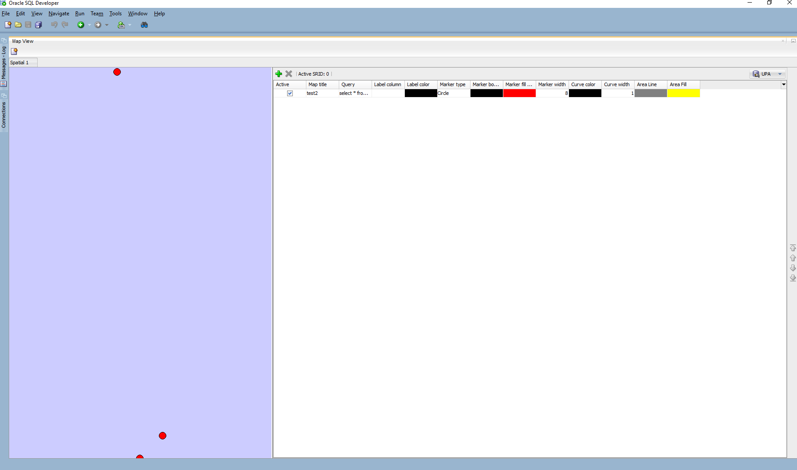

# UPA projekt
### Zakladna idea a funkcionality aplikacie
* Obrazky su v stromovej strukture zloziek
  * Priadavanie, mazanie, uprava obrazkov
  * Nad kazdym obrazkom sa daju robit zakladne upravy:
    * Premenovanie, rotacia...
  * Obrazkom ide priradit bod v priestorovych datach, na ktorom sa nachadzaju
  * Vyhladavanie obrazkov pomocou podobnosti
* Na 2d canvase zakladne operacie s viacerymi druhmi geometrii
  * Zakladne operacie s geometriami (mazanie, vkladanie, uprava)
  * 2 zlozitejsie operacie
  * 3 Analyticke funkcie 
    * Vypocet vzdialenosti medzi obrazkami v jednej zlozke
    * Priemerna vzdialenost, maximalna, minimalna...

### Build a deploy
1. Stiahnuť a vložiť libs z git repa: https://github.com/orlicekm/UPA-projekt
2. Nainstalovat gradle (`./gradle` / `gradle.bat`)
3. V root adresáři projektu zadat `$ gradle build`.
4. V daném adresáři spustit `$ gradle run`.

### UML diagram

### Map view for sparcial data example

